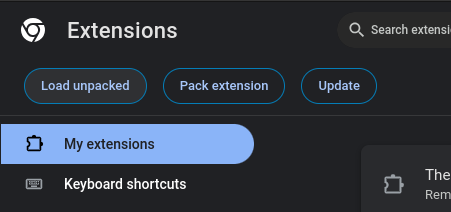

# Restore EduSkracacz
## Allows you to use the EDUVulcan site again as a link "shortener" by base32 redirect from eduvulcan.pl/dziennik

## Installation

 
[Development installation instructions](https://es.cvp.ovh/restoreduskracacz.html)

## Development Workflow
### Firefox
To load addon from files in Firefox, you need to go to `about:debugging#/runtime/this-firefox` and click `Load Temporary Add-on...`. After that you need to select manifest.json file in file picker. 

### Chrome
To load extension from files in Chrome, you need to go to `chrome://extensions/` and click `Load unpacked` (with developer mode enabled) 

